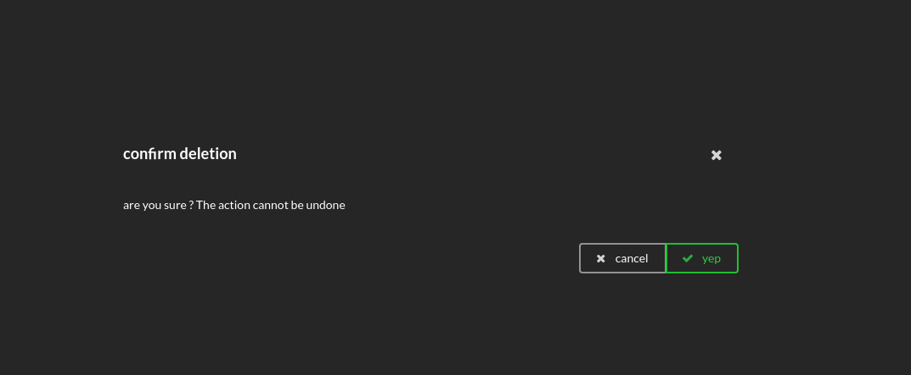
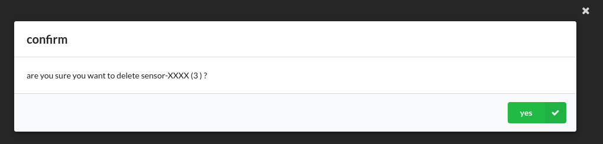
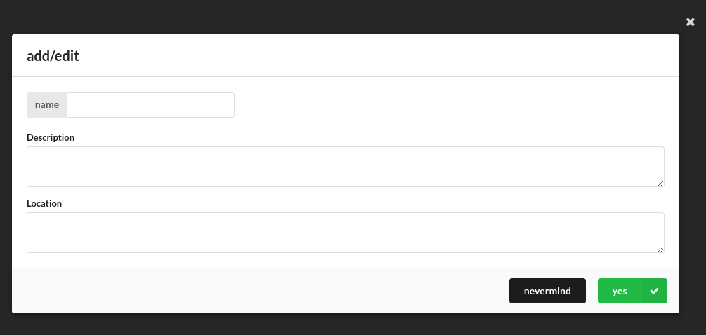

# semantic-modals

AngularJS ModalService for the semantic-UI framework.

# Quick start

1. load the script to your page
2. reference the module as a dependency to your angular app:
   
  ```js
  angular.module('app',
      [
          'semantic.modals',
          // other dependencies
      ]);
  ```
  
3. In your controller, use the `ModalService` :

 ```js
 angular
        .module( 'app' )
        .controller( 'MainCtrl', function(ModalService){
          var self = this;
          
          self.confirmModal = function(){
            ModalService.showModal({
              title : "confirm deletion",
              text: "are you sure ? The action cannot be undone",
              positive: "yep",
              negative: "cancel",
              basic: true
            }).then( function( result ){
                if(result.status){
                  console.log("deleting item...");
                }
            });
          };
          
        } );
 ```
 The result is : 
 
 
 

# Usage

### Available options

`showModals` accepts the following options:

- _title_ : the title of the modal,
- _text_ : the content of the modal, as a simple text,
- _html_ : the content of the modal, with html support,
- _htmlInclude_: the path to a file containing the content of the modal (uses `ng-include` internally),
- _templateUrl_: the id of a `ng-template`, to use only when you need your own modal code,
- _positive, negative_ : the text of the negative/positive buttons. If not present, the button won't appear,
- _basic_ : true/false, if true, the result will be a small basic modal, as presented in the semantic-ui examples,
- _inputs_ : an object which will be passed to the modal controller. It means you can use whatever you register in the inputs in your modal content, using `inputs.myVar` or `inputs.myFunc()`. But don't forget the modal is in an isolated scope,
- _cancelable_ : true/false, false by default. Whether or not clicking outside the modal closes it.

### Promise

The `showModal` function returns a `promise`, which is resolved upon modal close and rejected in case the modal could not be instanciated.
The resolve callback takes one argument: `{status: true/false, inputs: yourInputs}`. The `status` is `true` if the use pressed the positive button, `false` otherwise.
The `inputs` argument is passed back and can have been modified. It is useful for dialogs with forms for example.

# Examples

A confirm modal with html and `inputs` binding, no cancel button:

```js
ModalService.showModal( {
      title: "confirm",
      html: "are you sure you want to delete {{inputs.sensor.name}} ({{inputs.sensor.id}} ) ?",
      positive: "yes",
      basic: false,
      inputs     : {
          sensor: {id: 3, name: "merde"}
      },
      cancelable : true

  } ).then( function( result ){
      console.log( result );
      
  }, function(){
      console.log( "error" );
      
  } );
```



A modal using a partial:

```js
 ModalService.showModal( {
    title: "edit",
    htmlInclude: "html/_editModalContent.html",
    positive: "yes",
    negative: "nevermind",
    basic: false,
    cancelable : false

} ).then( function( result ){
    console.log( result );
}, function(){
    console.log( "error" );
} );
```

```html
// html/_editModalContent.html
<form name="editform" class="ui form" novalidate>
    <div class="ui labeled input">
        <!--name-->
        <div class="ui label">
            name
        </div>
        <input type="text" ng-model="inputs.name">
    </div>

    <!--description-->
    <div class="field">
        <label>Description</label>
        <textarea ng-model="inputs.description" rows="2"></textarea>
    </div>

    <!--location-->
    <div class="field">
        <label>Location</label>
        <textarea ng-model="inputs.location" rows="2"></textarea>
    </div>
</form>
```



A completely custom template:

```html
// ng template
<script type="text/ng-template" id="semanticModal.html">
    <div class="ui modal small">

        <i class="close icon" ng-click="close(false)"></i>
        <div class="header">
            edit {{inputs.sensor.id}}
        </div>
        <div class="image content">
            <div class="description">
                <form name="editform" class="ui form" novalidate>
                    <div class="ui labeled input">
                        <!--name-->
                        <div class="ui label">
                            name
                        </div>
                        <input type="text" ng-model="inputs.sensors.name">
                    </div>

                    <!--description-->
                    <div class="field">
                        <label>Description</label>
                        <textarea ng-model="inputs.sensor.description" rows="2"></textarea>
                    </div>

                    <!--location-->
                    <div class="field">
                        <label>Location</label>
                        <textarea ng-model="inputs.sensor.description" rows="2"></textarea>
                    </div>

                </form>
            </div>
        </div>
        <div class="actions">
            <div class="ui black deny button" ng-click="close(false)">
                Nope
            </div>
            <div class="ui positive right labeled icon button" ng-click="close(true)">
                Yep, that's me
                <i class="checkmark icon"></i>
            </div>
        </div>
    </div>
</script>
```

```js
ModalService.showModal( {
      templateUrl: "semanticModal.html",
      cancelable : false

  } );
```
